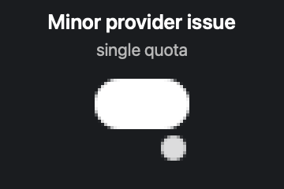
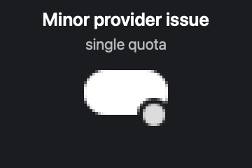

# Codex single-quota status badge proof

These screenshots use a fixed synthetic input: one full quota, no secondary quota or credits, and a minor
provider-status indicator. They contain only pixels from `IconRenderer` plus the generic labels shown in the
cards. No live provider, account, Keychain, desktop, username, email, or filesystem data is read or displayed.

| Before | After |
| --- | --- |
|  |  |

The before image was rendered from upstream `main` at `30a946c4c` with this branch's opt-in screenshot
harness. The after image was rendered after the status badge placement fix with the same synthetic input.

Generate the after proof with:

```sh
CODEXBAR_STATUS_ICON_PROOF_DIR=docs/screenshots \
  swift test --filter IconRendererScreenshotRenderTests.test_renderSyntheticSingleQuotaStatusBadge
```

The opt-in screenshot test is skipped during normal test runs.
